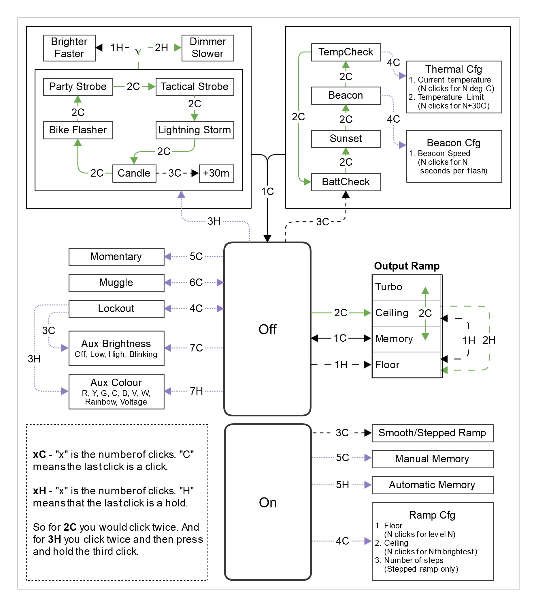

# Andúril User Interface

Andúril is an open-source flashlight user interface developed by ToyKeeper and used by many enthusiast flashlights. It provides a conventional ramping interface for normal flashlight use while also exposing configuration, auxiliary LED controls, strobes, battery and temperature information, and other advanced functions.

Despite the number of available functions, normal operation only requires a few commands.

## Basic Operation

From **Off**:

- **1C** — Turn on
- **1H** — Turn on at the floor level
- **2C** — Turn on at the ceiling level
- **3C** — Battery check
- **4C** — Lockout
- **5C** — Momentary mode
- **7C** — Change auxiliary LED brightness
- **7H** — Change auxiliary LED color

From **On**:

- **1C** — Turn off
- **1H** — Ramp brighter
- **2H** — Ramp dimmer
- **2C** — Turbo / ceiling
- **3C** — Switch between smooth and stepped ramping
- **4C** — Configure the output ramp

## Click Notation

Andúril documentation uses a compact notation for button presses:

- **C** means **Click**
- **H** means **Hold**

The number indicates how many button actions are performed.

For example:

- **1C** — Click once
- **2C** — Click twice
- **3C** — Click three times
- **1H** — Press and hold
- **3H** — Click twice, then press and hold on the third press

## Andúril Interface Map

The following diagram shows the major Andúril modes, shortcuts, and configuration paths.

> **Tip:** You do not need to memorize the entire interface. For ordinary use, `1C`, `1H`, `2H`, and `2C` cover most flashlight operation.

## Advanced Functions

Andúril also includes several utility and special-purpose modes:

- Battery voltage check
- Temperature check
- Beacon
- Sunset timer
- Candle mode
- Bike flasher
- Party strobe
- Tactical strobe
- Lightning storm
- Manual and automatic mode memory
- Thermal configuration
- Ramp floor and ceiling configuration
- Auxiliary LED brightness and color configuration

These functions are accessible through the click sequences shown in the interface map above.

## Simple UI and Advanced UI

Andúril firmware may provide both a **Simple UI** and an **Advanced UI**. Simple UI intentionally limits access to many configuration and special-purpose functions, while Advanced UI exposes the complete interface.

If a command shown in the diagram does not appear to work, verify that the flashlight is operating in Advanced UI.

## Additional Information

Andúril behavior can vary slightly depending on the flashlight, firmware version, hardware configuration, and manufacturer build. Always consider the firmware and documentation supplied for a particular light when a command differs from the general interface described here.

For the complete upstream documentation and current firmware source, see the ToyKeeper Andúril project.
