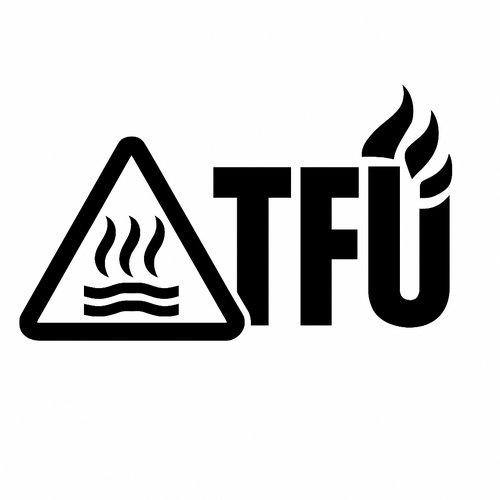

# Welcome to Your TFU-E2  

**Welcome to TFU – Real Gear for Hard Use**  
**TFU-E2 – Compact Triple-Emitter EDC Platform**

---

## Overview

The **TFU-E2** is a compact, high-output, high-CRI EDC platform built around a **triple Nichia array** and a **5 A regulated buck driver**.  
It is designed as a premium everyday tool for technicians, field users, and anyone who values clean color rendering and reliable, predictable output.

Every TFU-E2 is hand-assembled, thermally tuned, and QC’d at the Boathouse.

_Primary mission:_ A compact triple with elite tint, smooth beam, and real-work reliability.

---

## Emitter Options

The TFU-E2 comes in two configurations. Both are excellent — choose based on preference:

### **TFU-E2 / 219BT (4500 K, CRI90+)**  
- True-to-life tint  
- Beautiful rosy-neutral character  
- Exceptional color rendering indoors and outdoors  
- The “photographer’s pick”

### **TFU-E2 / 219F (5000 K, CRI90+)**  
- Clean, honest, neutral-white appearance  
- Slightly cooler without going blue  
- Excellent task/inspection light  
- The “technician’s pick”

Both use **Kai’s 20 mm MCPCBs** and **Carclo 10511 optics** for a smooth, wide, usable beam.

---

## At a Glance

- **Emitter:** Triple Nichia 219BT 4500K *or* triple Nichia 219F 5000K  
- **CRI:** 90+  
- **Optic:** Carclo 10511  
- **Driver:** 5 A buck driver (regulated)  
- **Host:** Convoy S2+ (sterile)  
- **Battery:** 18650 (Samsung 30Q, Molicel M35A recommended)  
- **Beam:** Wide, clean, artifact-free  
- **Thermals:** Stable regulation with smooth stepdowns  

---

## Build Notes

Each TFU-E2 receives:

- MX-4 thermal paste application  
- Driver seating and electrical verification  
- Optic alignment check  
- Threads cleaned and silicone-greased  
- Tail spring bypass  
- Internal serial label + Boathouse QC Pass  

This is not a hobby build — it’s a field tool.

---

## Operating Tips

- Medium and high modes give best output/runtimes.  
- Triples run warm — normal behavior.  
- Turbo is for short bursts; stepdowns are expected.  
- Use only high-quality 18650 cells.  
- Store at ~3.7–3.8 V when not in active rotation.

---

## Battery Recommendations

- **Samsung 30Q** – High output  
- **Molicel M35A** – Long runtime  

Avoid low-quality cells — triples pull honest current.

---

## Warranty & Support

TFU lights are built for real-world use.  
If a defect or workmanship issue arises, the Boathouse will make it right.

Built by hand in the U.S.A.  
For full documentation, warranty, and updates, visit:  
🔗 [TFU Project on GitHub](https://github.com/TheSmashy/TFU)  
🔹 [Warranty and Support](https://github.com/TheSmashy/TFU/blob/main/ops/WARRANTY.md)  
**Contact:** [TFU-Lights@wmode.anonaddy.com](mailto:TFU-Lights@wmode.anonaddy.com) \| Reddit: u/thesmashy

---

**Tip:**  
Record your serial and build date for quicker support. Enjoy your TFU‑E2—use it hard and let me know your story.

---

## Thank You

Your TFU-E2 is a hand-made, serialized piece of kit built with care and intent.  
Thank you for supporting American-made lights from a builder who gives a damn.

**Fight the darkness. Fight with class.**
