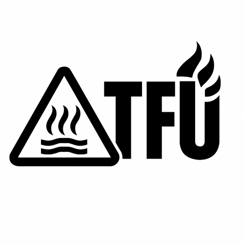

# Welcome to Your TFU-T4 Alpha

**TFU — Real Gear for Hard Use**  
**TFU-T4 Alpha — High-Intensity Thrower**

---

## Overview

The **TFU-T4 Alpha** is a compact, high-intensity thrower built for maximum beam intensity.

Using an **Osram NM1 emitter** driven by a **regulated 5A buck driver**, the T4 Alpha produces a tightly focused, high-candela beam with extreme visibility at distance.

This is not a general-purpose light. It is a specialized tool for long-range illumination.

---

## At a Glance

- **Emitter:** Osram NM1  
- **Driver:** 5A buck (regulated)  
- **Battery:** 14500 Li-ion  
- **Modes (default):** 1% → 10% → 50%  
- **Optional Mode Group:** 1% → 20% → 100%  

---

## Beam Profile

The T4 Alpha is tuned for **maximum intensity**.

- Extremely tight hotspot  
- Minimal spill  
- Very high candela  

This makes it ideal for:

- Long-range identification (PID)  
- Signaling  
- Situations where distance matters more than area lighting  

---

## Performance Notes

- Significantly higher intensity than standard emitters  
- Beam is highly visible, even at long distances  
- Minimal spill limits usefulness for close-range tasks  

100% mode (if enabled):

- Extremely intense output  
- Rapid thermal rise  
- Best used in short bursts  

---

## Build Features

- MX-4 thermal interface under MCPCB  
- Loctite-secured retaining rings  
- Tail spring bypass (reduced resistance, improved performance)  
- Deep-carry clip  
- Recon Green camo finish  

---

## Use Philosophy

This is not a polite light.

The **T4 Alpha** is built for maximum intensity and will project a highly visible beam. It will attract attention.

Use accordingly.

This light is intended for users who understand what a high-candela thrower is and how it behaves.

---

## Battery Guidance

Recommended:

- Vapcell F12 / F15 for balanced use  
- High-drain cells can be used when running 100% mode (Vapcell K10)  

---

## ⚠️ Usage Notes

- Not intended for close-range use  
- Avoid pointing at people, vehicles, or reflective surfaces at close distance  
- Be aware of visibility over long distances  

The Boathouse recommends a quick vibe check with your wife before use on your property, unless you are dealing with an actual problem.

---

## Programming & Configuration

**[TFU 14500 Configuration Guide](../docs/config_guide_14500.md)**

Includes:
- All mode groups  
- Memory on/off  
- Thermal behavior  
- Reset procedure  

---

## Summary

The **TFU-T4 Alpha** is the extreme end of the T8 platform:

> Maximum intensity. Minimum compromise.

If you know why you want this light, this is the right tool.  

---

## Warranty & Support

TFU lights are built for real-world use.  
If a defect or workmanship issue arises, the Boathouse will make it right.

Built by hand in the U.S.A.  
For full documentation, warranty, and updates, visit:  
🔗 [TFU Project on GitHub](https://github.com/TheSmashy/TFU)  
🔹 [Warranty and Support](https://github.com/TheSmashy/TFU/blob/main/ops/WARRANTY.md)  
**Contact:** [TFU-Lights@wmode.anonaddy.com](mailto:TFU-Lights@wmode.anonaddy.com) \| Reddit: u/thesmashy

---

**Tip:**  
Record your serial and build date for quicker support. Enjoy your TFU‑T4A—use it hard and let me know your story.
