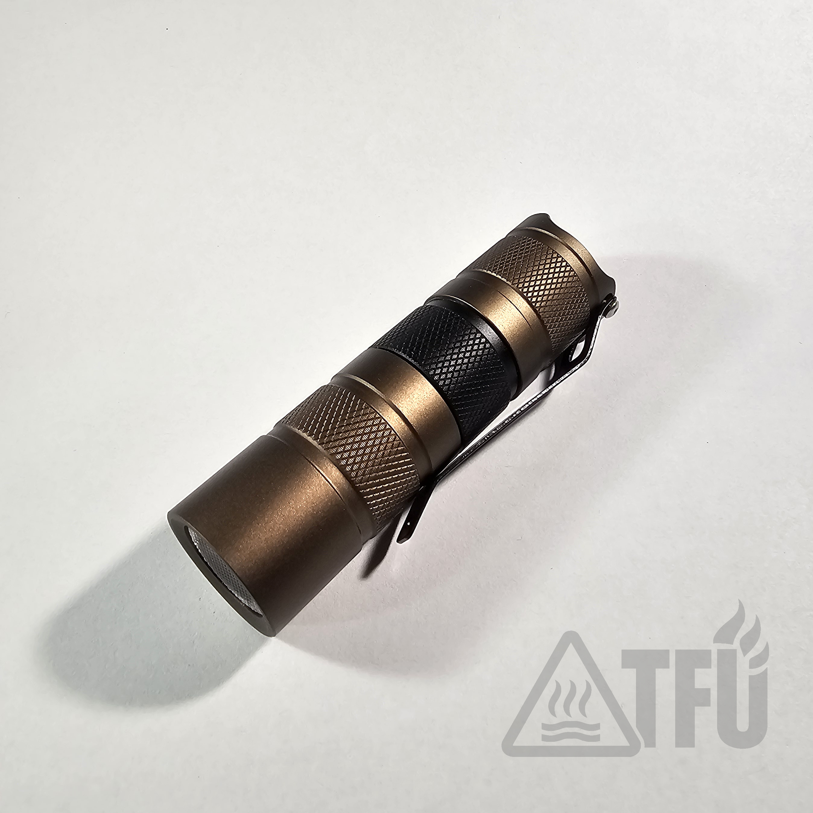

# TFU‑E1

**Series:** E (Everyday/ EDC)

**Host:** Convoy S2+

**Colorway:** Tan and black

The TFU‑E1 is a compact EDC flashlight built from the rugged Convoy S2+ host and hand‑tuned for serious users who need dependable light.  Built and tested in the U.S., it’s offered in two versions to suit different color temperature preferences:
- **Mk I (3500 K):** Uses a warm-white emitter for natural color rendering and comfortable low-light use.
  - *This warm CCT emitter is good for rain, fog, snow, and dust, and produces a reduced signature.*
- **Mk II (5000 K):** Features a neutral-white emitter for balanced color reproduction and increased brightness.
  - *This neutral CCT is good for technical work, inspection, and more natural color resolution.*

Both versions share the same high‑quality components and are assembled with attention to reliability, function and field use.

  

*TFU-E1 shown with black stainless clip. Built on a Convoy S2+ host with Nichia B35AM emitter.*  

  

*TFU-E1 shown with stock Convoy to highlight metal button and custom clip hardware.*

## Specifications

- **Cell size:** 18350
- **Recommended cell:** Vapcell H16
- **Driver:** 6 V 2 A Boost
- **Emitter:** Nichia B35AM
- **User interface:** 1 % → 10 % → 35 % → 100 % with memory off
- **Runtime:** 45 minutes at 100 %
- **Optic:** 20‑degree bead
- **Weight:** 66 g (dry)
- **Dimensions:** 86 mm length × 24.1 mm diameter
- **Clip:** Black steel tail clip
- **Hardening:** Loctite 242, CS109 thermal adhesive
- **Water protection:** [IPX8](../Assets/TFU-E1-Dunk-Test.jpg)
- **Impact resistance:** 1 m drop tested
- **Electrical mod:** Tail spring bypass (22 AWG)

### Tuning and Options

Each TFU‑E1 is hand tuned.  Output levels, beam characteristics, and firmware options (e.g., Biscotti or Andúril) can be customized to fit your application.  Reach out via the contact information in the README if you have specific requirements or would like to order a custom build.

## Thermal Behavior  

- **Test**: 15-minute continuous run at 100% from cold start, still air.  
- **Ambient**: ~18–19 °C (yellow trace).  
- **Probe**: surface/ head near bezel.  
- **Result**: Peak 36.8 °C surface temp (ΔT ≈ +18 °C over ambient). No step-down or throttle; remained hand-holdable.  
- **Cooldown**: returned to ambient over ~45 min after power-off.  

*TFU-E1 Mk I — 15-min @ 100%: peak 36.8 °C; ambient ~18.5 °C.*
