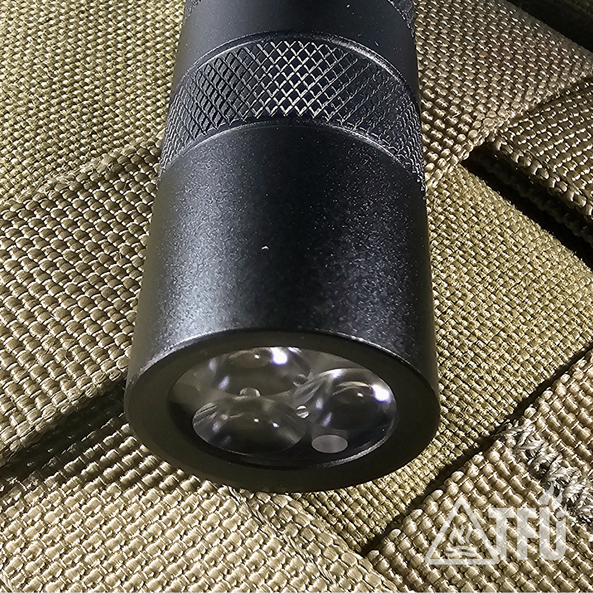
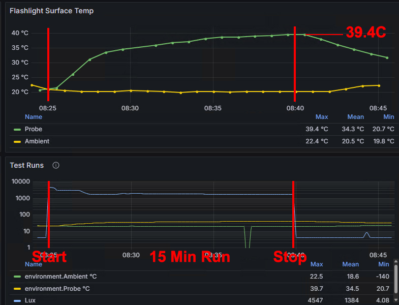

# TFU-E2 — Triple 219BT EDC

**Series:** E (Everyday / EDC)  
**Host:** Convoy S2+ (including sterile hosts from early builds)  
**Colorway:** Black  
**Status:** Production  
**Revision:** 1.0  

---

## Design Overview

The **TFU-E2** is a compact, high-CRI triple-emitter light built on the proven Convoy S2+ platform.  
Designed for everyday carry and task lighting, it prioritizes **beam quality, color accuracy, and reliability** over marketing lumen counts.

Every E2 is **hand-assembled, thermally tuned, and electrically hardened** to meet TFU standards for field durability and performance.

---

## Specifications

| Parameter | Value |
|------------|--------|
| **Cell Size** | 18650 |
| **Recommended Cell** | Samsung 30Q |
| **Driver** | 5 A Buck (12-group UI) |
| **Emitter** | Triple Nichia 219BT 4500 K CRI90 |
| **Optic** | Carclo 10511 (narrow clear spot) |
| **UI** | Mode Group 10 → 1 % / 10 % / 35 % / 100 %, memory off |
| **Clip** | Convoy S21A black steel deep-carry |
| **Dimensions** | 118 mm L × 24 mm Ø |
| **Weight** | *TBD* g (dry) |
| **Hardening** | MX-4 TIM, CS109 adhesive, 7 mm Cu spacer, Loctite 242 |
| **Protection** | IPX8 expected / 1 m impact-tested |
| **Electrical Mods** | Tail spring bypass (22 AWG) / tight ground path tolerance |

---

## Role & Deployment

The **E2** is optimized for **EDC, inspection, and close-range task lighting**.  
Its 4500 K triple-emitter beam provides neutral, high-fidelity color for indoor and outdoor use, with smooth flood and excellent detail rendering.

**Key use cases:**  
- Field and bench technicians  
- Tradespeople requiring accurate color rendering  
- EDC users valuing low-signature, honest light  

---

## Why 219BT Triple

The 219BT triple configuration was chosen for its *efficiency, fidelity, and character*.  
Running three 219BT emitters at 5 A produces a well-regulated, neutral beam with real endurance in the hand.

**Beam comparisons:**  
- [219B 4500 K](../Assets/TFU-E2-219BT-4500K-219B-4500K-2m-Garage.jpg) → rosy tint, pleasing but niche  
- [519A 4500 K](../Assets/TFU-E2-219BT-4500K-519A-4500K-2m-Garage.jpg) → creamy white, excellent generalist  
- [219BT 4500 K](../Assets/TFU-E2-219BT-4500K-5m-Garage.jpg) → clean neutral white, high contrast, truthful rendering  

> **Doctrine:** *Builds should not only work — they should reveal the truth of the light.*

---

## Clip Specification — TFU Doctrine

The E2’s clip is a **mission component**, not decoration.

- **Required:** Convoy S21A black oxide clip  
- **Why:**  
  - Wide stance → resists torsion and bending  
  - Robust spring tension → secure retention under movement  
  - Deep carry profile → low signature and comfort  

**Rejected:**  
- Standard S2/M1 clips → weak stance and shift under load  
- Boutique aftermarket → non-mission aligned  

> **Doctrine:** The clip is part of the tool. Simpler is stronger.

---

## Runtime & Output  
*(Samsung 30Q cell / 5 A buck / 3 × 219BT + Carclo 10511)*

| Mode | Est. OTF Lumens | Est. Runtime | Notes |
|------|------------------|--------------|--------|
| 1 %  | 10 – 15 lm | 40 – 60 h + | Ultra-low map/inspection |
| 10 % | 130 – 160 lm | ≈ 6 h | General task output |
| 35 % | 475 – 525 lm | 1.5 – 1.9 h | High utility mode |
| 100 % | 1,300 – 1,500 lm (peak) | 30 – 40 min | Regulated until ≈ 3.4 V then taper |

*Values derived from 219BT nominal data and 30Q discharge curve.  
Measured results logged via Pi rig → InfluxDB → Grafana.*

**Test parameters:**  
- Cell: Samsung 30Q  
- Mode: 100 % (Group 2)  
- Ambient: 20 °C  
- Lux distance: 1 m  
- Logging: 30 s intervals  

---

## Hardening Notes

**Model:** TFU-E2 (Triple 219BT, Carclo 10511)  
**Driver:** Convoy 5 A linear (Loctite + CS109 bonded)  
**Spacer:** MTN 7 mm copper – drilled and fitted  
**Optic:** Carclo 10511 + 1 mm clear O-ring compression  

---

### Mechanical Stack Integrity
- **Driver Retention:** Driver seated with thermal adhesive + Loctite ring to prevent micro-movement and maintain ground continuity.  
- **Optic Compression:** Transparent 1 mm O-ring locks Carclo 10511 without light signature after power-off.  
- **Spacer Fitment:** 7 mm Cu spacer drilled for lead routing; adds thermal mass and height correction.  

### Thermal Path
- **MX-4 (TIM):** Between MCPCB and spacer; non-curing and electrically safe.  
- **CS109 (Adhesive):** Between spacer and pill; bonds mechanically and electrically.  
- **MCPCB Seating:** Triple board clamped flush with zero air gap for direct heat flow to host.  

### Electrical Reliability
- **Emitter Board:** 219BT triple (parallel) reflowed under flux, polarity verified.
- **Driver**: 5A buck with 22 AWG bypass for reduced resistance.
- **Switch:** Convoy reverse clicky + 22 AWG bypass for reduced resistance.  
- **Ground Path:** Spacer bonded to pill; driver secured with adhesive and Loctite for low-impedance continuity.  

---

## Why Harden

TFU lights are **tools, not trophies.**  
Hardening ensures reliability under abuse:

- No floating drivers  
- No rocking MCPCBs  
- No optic shift under compression  
- No thermal bottlenecks  

Every adhesive, spacer, and O-ring choice supports one goal: **a light you can trust in the field.**   

---

**Version:** TFU-E2 Rev 1.0  
**Last Updated:** 2025-10-14  

Built by hand in the U.S.A.  
🔗 [TFU Project on GitHub](https://github.com/TheSmashy/TFU)  
🔹 [Warranty and Support](https://github.com/TheSmashy/TFU/blob/main/ops/WARRANTY.md)  
**Contact:** [TFU-Lights@wmode.anonaddy.com](mailto:TFU-Lights@wmode.anonaddy.com) | Reddit: u/thesmashy
