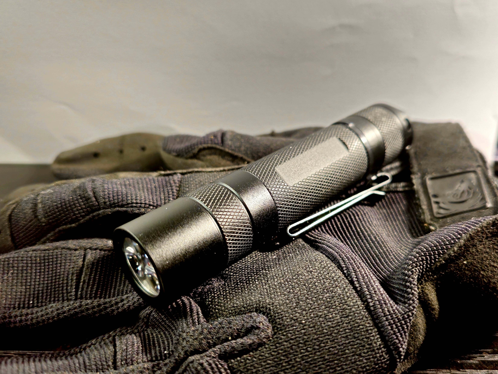
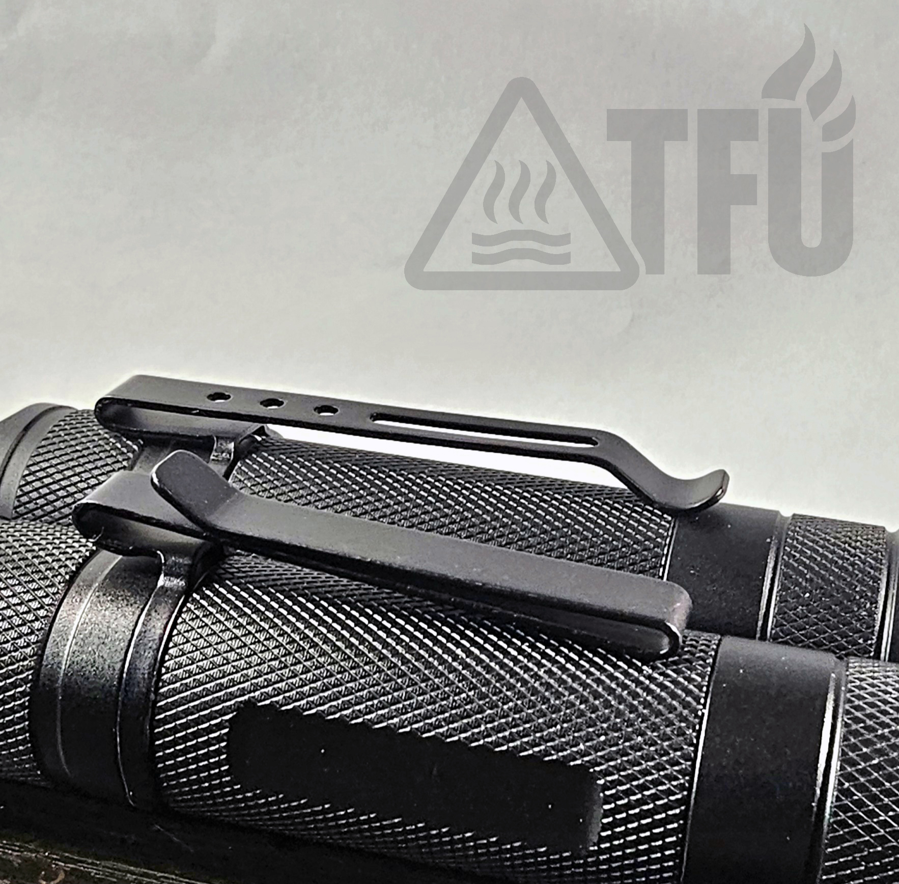

# TFU-E2

**Series:** E (Everyday / EDC)  
**Host:** Convoy S2 (including sterile hosts observed in early builds)  
**Colorway:** Black and grey  

The TFU-E2 is a compact, high-CRI triple emitter light built on the proven Convoy S2 platform. Designed for everyday carry and practical utility, the E2 prioritizes beam quality, color accuracy, and controlled output over raw lumens. All builds are hand-assembled, thermally tuned, and electrically hardened to meet TFU standards.

**Status:** In Development  
_Provisional spec — subject to refinement pending full runtime and thermal testing._

## Specifications 

- **Cell size:** 18650  
- **Recommended cell:** Samsung 30Q (baseline) or Molicel M35A (runtime focus)  
- **Driver:** 5 A Buck (12-group UI)  
- **Emitter:** Triple Nichia 219BT (4500 K, 90 CRI)  
- **User interface:** Mode group 10 (1 % → 10 % → 35 % → 100 %), memory off  
- **Optic:** Carclo 10511 (narrow clear spot, beam confirmed excellent)  
- **Weight:** *TBD* g (dry)  
- **Dimensions:** 118 mm length × 24 mm head diameter  
- **Clip:** Black steel S21A clip 
- **Hardening:** MX-4 thermal interface, CS109 adhesive, copper thermal spacer stack  
- **Water protection:** IPX8 expected  
- **Impact resistance:** 1 m drop tested  
- **Electrical mod:** Tail spring bypass (22 AWG), tight thermal and electrical tolerances  

## Role & Deployment

The TFU-E2 is designed for **EDC, inspection, and close-range task lighting** where beam fidelity and neutral color temperature are key. With its 4500 K triple-emitter array and regulated 5 A buck driver, the E2 delivers a clean, color-accurate beam suitable for both indoor and outdoor use. The low-profile S2 host offers a slim profile without compromising output, while the option to swap between 18650 and 18350 formats gives flexibility between runtime and compactness.

Ideal for:
- Tradespeople and technicians  
- EDC enthusiasts  
- Low-signature, high-fidelity environments  

## Why 219BT Triple?

At first glance, you might ask: *why run a 219BT triple at 5A when a single 519A at 5000–4500K already performs so well?*  

The answer comes down to design intent. We pursued the 219BT triple as a compact, low-power EDC path — and testing showed it was far more than “enough.”  

- **Efficient power curve:** A 5A triple provides endurance across real-world EDC modes without overwhelming heat.  
- **Beam quality:** The 219BT 4500K 90CRI punches above its weight. Compared to other TFU-standard emitters:  
  - 219B 4500K → rosier tint, pleasing but niche.  
  - 519A 4500K → creamy, soft white, excellent generalist.  
  - 219BT 4500K → deliberate, honest, serious white that renders detail cleanly without oversaturation.  

The result is a beam that feels purposeful. It doesn’t flatter, it doesn’t soften — it tells the truth. That honesty is what made the 219BT triple worth standardizing.  

>**Doctrine:** *Builds should not only work — they should reveal the truth of the light.*  

## Clip Specification – TFU-E2 Doctrine

The TFU-E2 is **field-ready by design**. Clip selection is not aesthetic — it is functional.

- **Required Clip:** Convoy S21A stainless clip, black oxide finish.  
- **Rationale:**  
  - **Wide stance** → stability under stress, prevents torsion.  
  - **Robust spring tension** → secure retention without bending.  
  - **Deep carry profile** → reduced signature and enhanced comfort.  
- **Rejected Options:**  
  - Standard Convoy S2 / M1 clips → narrow stance, less retention, prone to shift.  
  - Boutique aftermarket clips → unnecessary complexity, non-mission aligned.  

> **Doctrine:** The clip is part of the tool. Simpler is stronger. Rugged beats fancy.

## TFU-E2 Runtime & Output (30Q, 5A Buck, 3×219BT + Carclo 10511)

| Mode | Calculated OTF Lumens | Calculated Runtime | Measured OTF Lumens | Measured Runtime |
|------|-----------------------|--------------------|---------------------|------------------|
| 1%   | ~10–15 lm             | 40–60+ h           | TBD                 | TBD              |
| 10%  | ~130–160 lm           | ~6–6.5 h           | TBD                 | TBD              |
| 35%  | ~475–525 lm           | ~1.5–1.9 h         | TBD                 | TBD              |
| 100% | ~1,300–1,500 lm       | ~30–40 min         | TBD                 | TBD              |

*Calculated values are based on nominal 219BT emitter performance, 5A buck efficiency assumptions, and Samsung 30Q discharge characteristics.  
Measured values will be logged with lux + thermal data via Pi test rig (InfluxDB → Grafana).*

## Runtime & Thermal Performance

  
*Placeholder — runtime and thermal data will be added after TEST-O-MATIC-PI benchmarking.*

**Test parameters (planned):**  
- Cells: Samsung 30Q (mk0A), Vapcell M11v2 (mk0B)  
- Mode: 100 % (Mode Group 2)  
- Ambient: *TBD* °C  
- Distance to lux sensor: *TBD* m  
- Logging interval: *TBD* seconds  

# TFU-E2 Hardening Notes

**Model:** TFU-E2 (Triple 219BT, Carclo 10511)  
**Driver:** Convoy 5 A linear (Loctite + glue seated)  
**Spacer:** MTN 7 mm copper, drilled and fitted  
**Optic:** Carclo 10511 with transparent 1 mm o-ring  

---

## Mechanical Stack Integrity

- **Driver Retention:** The 5 A Convoy driver is seated with thermal adhesive and Loctite on the retaining ring. This prevents micro-movement and ensures sustained electrical contact under recoil, shock, or repeated thermal cycles.  
- **Optic & O-Ring:** A transparent 1 mm o-ring locks the Carclo 10511 optic into the host without light signature after power-off. Maintains compression across the emitter stack.  
- **Spacer Fitment:** MTN 7 mm copper spacer drilled to spec for wire routing. Provides both height correction and additional thermal mass.  

---

## Thermal Path

- **MX-4 (MCPCB):** Applied between the MCPCB and spacer to ensure maximum thermal conductivity. MX-4 is non-curing, stable, and electrically non-conductive.  
- **CS109 (Spacer):** Conductive adhesive used between spacer and pill to bond mechanically and electrically. Creates a unified thermal/electrical path that resists vibration and loosening.  
- **MCPCB Seating:** The Nichia 219BT triple MCPCB is clamped and compressed against copper with zero air gap, guaranteeing fast heat transfer into the body.  

---

## Electrical Reliability

- **Emitter Board:** 219BT triple (parallel) with reflowed solder joints under flux. Verified polarity and continuity pre-assembly.  
- **Switch:** Convoy reverse-clicky with spring bypass for reduced resistance. Dodgy Kai switch removed. Tail upgrade ensures consistent current delivery under 5 A draw.  
- **Ground Path:** Spacer and pill bonded with CS109; driver secured with adhesive + Loctite. Eliminates high-resistance ground points.  

---

## Why Harden?

TFU lights are not “show pieces.” They are built as **tools for hard use**. Hardening eliminates weak links:  
- No floating drivers  
- No rocking MCPCBs  
- No optic shift under compression  
- No thermal bottlenecks  

Every step — from adhesive choice to o-ring transparency — is designed to make the E2 a light you can *trust in the field*.  

---
