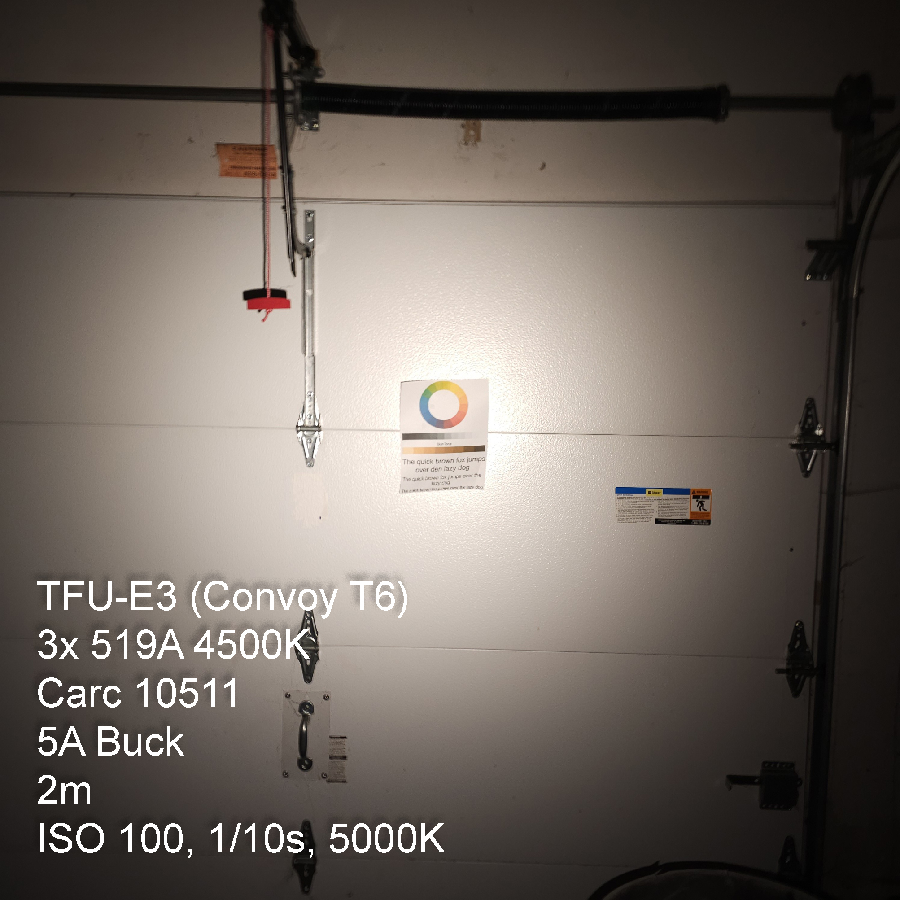

# TFU-E3 — Pocket Triple 519A

**Model:** TFU-E3  
**Series:** E (Everyday / EDC)  
**Status:** Production   
**Revision:** 1.0  

---

## Design Philosophy

The **TFU-E3** is a *compact, high-CRI pocket light* designed around a single 14500 cell.  
It delivers regulated 5-amp performance from a **triple Nichia 519A 4500 K** array, producing a bright, neutral, and accurate beam in a body small enough for daily carry.

Built on TFU’s *field-ready EDC* ethos, the E3 emphasizes:

- **Efficiency over gimmicks:** regulated 5 A buck driver for consistent output  
- **Compact authority:** a full triple on 14500 power  
- **High-fidelity light:** 519A 4500 K R9080 for color accuracy and comfort  
- **Mechanical honesty:** aluminum spacer for weight, copper board for heat, BeCu tail spring with 22 AWG bypass for reliability  
- **Serviceability:** standard Convoy geometry, Loctite only where necessary

The E3 bridges the gap between the desk-friendly E2 and the work-grade F1 — a **pocket-sized powerhouse** for technicians, engineers, and operators who want perfect color rendering without bulk.

  
---

## Assembly Notes

### Thermal Stack
1. Clean and lap shelf if necessary.  
2. Apply thin MX-4 between pill → spacer → MCPCB.  
3. Torque optic evenly; verify full contact.

### Wiring
- 20 AWG silicone leads, short with gentle slack.  
- Tin lightly; avoid cold joints.  
- Verify polarity before final torque.

### Tail Assembly
- Install BeCu spring.  
- Solder 22 AWG bypass *inside* coil from base pad to one turn below top.  
- Add PTFE sleeve or Kapton wrap at exit for strain relief.  
- Ensure full compression travel without tension.  
- Flood-solder switch PCB traces; clean ground faces.

### Driver Installation
- Seat driver flush; secure ring firmly.  
- Confirm ground continuity.  
- Apply Loctite 242 after verification.

### Final Torque & Cure
- Allow Loctite and CS-109 to set overnight before runtime testing.

  

---

## QC Checklist

| Test | Spec | Pass Criteria |
|------|------|----------------|
| Tailcap V-drop @ max | ≤ 0.08 V | Stable, no flicker |
| Thermal check (60 – 90 s) | Even head warmth | Tail remains cool |
| Flicker / impact test | None | Survives gentle tap |
| Mode sequence | 0.1 → 1 → 20 → 100 (± Turbo) | Memory off |
| Thread engagement | Smooth, clean | Torque marks applied |
| Beam quality | Centered, no artifacts | Optic secure |

---

## Electrical / Optical Data

- **Driver:** 5 A buck; holds regulation to ≈ 3.4 V.  
- **LEDs:** 519A (Vf ≈ 3.0 V @ 1.5 A ea).  
- **Output:** ≈ 1100 – 1200 lm initial, CRI 90+, CCT 4500 K DUV +0.000 → +0.002.  
- **Runtime:** ≈ 30 min regulated on Vapcell H10.  
- **Thermal limit:** 55–60 °C head temp (stable).  
- **Cell:** Vapcell H10 recommended; 10 A class, unprotected 14500 (flat or button top).

### Estimated Output and Runtime

| Mode           | Output (lm)                   | Est. Runtime (Vapcell H10 @ 25 °C) | Notes                                         |
|----------------|-------------------------------|------------------------------------|-----------------------------------------------|
| **Low (1%)**   | ≈ 10 lm                       | ≈ 20 hr +                          | Ultra-low inspection / map mode               |
| **Med 1 (10%)**| ≈ 120 lm                      | ≈ 3 hr +                           | Excellent indoor / task output                |
| **Med 2 (35%)**| ≈ 400 lm                      | ≈ 80 – 90 min                      | Continuous work use; minimal thermal rise     |
| **High (100%)**| ≈ 1150 lm (peak) → ≈ 900 lm (sustained) | ≈ 30 min regulated → 50 min total with falloff | Regulated until cell ≈ 3.4 V; gradual taper |
| **Thermal limit** | —  | Head stabilizes 55–60 °C  | No stepdown flicker; constant regulation  |

  
  

---

## Usage / Care

### Battery & Charging
- **Use only high-drain unprotected 14500 cells** (e.g., Vapcell H10).  
- **Do not** insert primary AA cells; voltage is incompatible.  
- Remove cell if storing > 30 days. Store at ≈ 3.7 – 3.8 V (storage voltage).  
- Charge with a quality lithium-ion charger; stop at 4.20 V max.

### Cleaning & Maintenance
- Wipe threads with IPA and re-grease lightly with non-conductive silicone grease.  
- Keep lens and optics free of debris; use a soft microfiber cloth.  
- Inspect springs and bypass wire for fatigue or solder cracks every 6 months.  
- Reapply Loctite if retaining rings are ever removed.  
- Replace MX-4 paste after heavy service or if disassembled.

### Operating Guidelines
- Avoid prolonged use on Turbo in still air; allow cooling intervals.  
- Do not block the optic or head vents while running at full power.  
- If output flickers or dims abruptly, check cell voltage and tail bypass first.  
- The E3 is water-resistant, not submersible — keep threads greased for sealing.  
- Treat it like a tool: tight rings, clean contacts, fresh cells.

### Service Interval
- **Every 6 months:** thread clean & regrease, bypass inspection.  
- **Annually:** full tear-down and thermal paste refresh if used heavily.

---

## Build Philosophy Summary

> **Pocket-Sized Triple, Full-Sized Performance.**

The TFU-E3 isn’t chasing lumens — it’s chasing *truth in light.*  
A single 14500 cell driving three 519As through a real buck driver delivers honest output and beautiful color rendering.  
Aluminum where it matters, copper where it counts, and solder where the current flows.  
Built for the field, carried for life.

---
