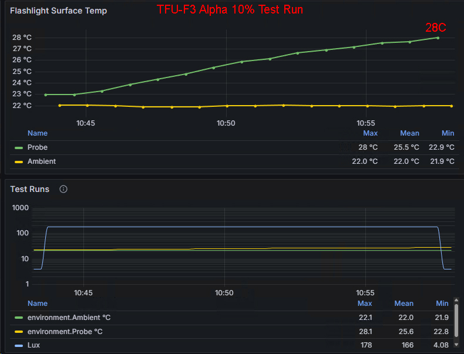

# TFU-F3 “Alpha” — Directed Mule Flood Light (519A / 5000 K)

**Model:** TFU-F3A  
**Series:** F-Series (Field / Flood)  
**Host:** Convoy S16 (21700 platform)  
**Type:** High-CRI Directed Mule / Field Work Light  
**Release:** Production Model — October 2025  

---

## Overview

The **TFU-F3 Alpha** is the next-generation evolution of the original F3 platform:  
a 2S2P quad-emitter mule built around **Nichia 519A 5000 K (90 CRI)** and powered by a **6 V 5 A boost driver** for stable, efficient, real-world field use.

Replacing the earlier 6 V 8 A buck system, the Alpha’s upgraded boost regulator delivers a *sane*, optimized power curve:  
better efficiency, longer sustained output, and dramatically improved runtime without sacrificing the F3’s trademark wide, directed flood.

This is the **daylight-neutral** F3 — the clean white, high-CRI workhorse of the Field series.

---

## Hardware Specifications

| Component | Specification |
|----------|---------------|
| **Host** | Convoy S16 aluminum (21700, matte black) |
| **Emitters** | Quad Nichia 519A 5000 K (90 CRI) — 2S2P on 20 mm DTP copper MCPCB |
| **Optic** | None — open emitter array (“Directed Mule”) |
| **Driver** | 6 V 5 A boost regulator (optimized for sustained output) |
| **Lens** | AR-coated protective glass |
| **Switch** | Reverse clicky; 22 AWG spring bypass |
| **Power** | 1× 21700 Li-ion (recommended: Molicel P45B) |
| **Finish** | Type III hard anodized black |
| **Clip** | Deep-carry steel |

---

## Performance Profile

- **Drive current:** 5 A regulated (boost architecture)  
- **Emitter configuration:** Quad 519A, 2S2P (~1.25 A per die equivalent)  
- **Output (est.):** 1 600–1 900 lm of crisp, high-CRI neutral white  
- **CRI:** ~90 (true daylight rendering)  
- **Runtime:** Strong sustained output with significantly improved longevity over the 8 A buck platform  
- **Thermal behavior:** Efficient conversion → slower heat saturation, reduced throttling  
- **Beam:** Wide-area mule flood with forward bias — clean, artifact-free  
- **Working range:** 0–20 m practical field illumination  

---

## Character & Purpose

> **“Alpha is the field light you trust when you’re not chasing numbers — you’re doing work.”**

The TFU-F3 Alpha takes the lessons of the original F3 legacy platform and refines them into a balanced, daylight-neutral flood tool:

- Bright without being wasteful  
- Color-accurate without being warm  
- Efficient without sacrificing output  
- Mule-style situational awareness in any environment  

It is the **primary F3 production model** for technicians, inspectors, field operators, and anyone who needs a dependable work flood with real runtime.

---

## 10% Thermal & Output Stability Test

  
*TFU-F3 Alpha — 10% runtime test. Stable lux curve and controlled temperature rise.*

### Summary
Low-power field mode (10%) is intended for extended task work, navigation, and general illumination. The 6 V 5 A boost driver and 2S2P 519A array show highly stable behavior at this level.

### Observations
- **Temperature:** ~23 °C → ~28 °C over ~12 minutes  
  - Gentle rise, no oscillation  
  - Driver maintains high efficiency  
- **Lux stability:**  
  - Flat plateau with no visible droop  
  - No voltage-sag artifacts or stepping  
- **Ambient:** ~22 °C (stable)

### Interpretation
At 10%, the Alpha provides **predictable, regulated output** suitable for long-duration use:

- No throttling  
- No flicker  
- No step-downs  
- Emitters remain well below thermal roll-off

This is the **“finish-the-job” mode** — consistent, neutral-white flood lighting even late in a mission or work session.

### Operational Notes
- Expect **multi-hour runtime** with P45B/P42A.  
- Ideal for **inspection, bench work, indoor/outdoor navigation**, and low-stress field tasks.  
- Serves as the Alpha’s baseline stability reference for higher-mode behavior.

## 100% Output – 10 Minute Thermal & Lux Test

**Conditions:** Indoor, ~21.5 °C ambient  
**Mode:** 100% (full power)

### Thermal Behavior
- The light rises quickly into the low–mid 30 °C range within the first few minutes.  
- Surface temperature plateaus around **43–44 °C**, demonstrating controlled, predictable thermal behavior.  
- No thermal runaway or oscillation observed.  
- Ambient remained stable at **~21.5 °C** throughout the test.

### Output Stability (Lux)
- Initial ramp shows a clean, immediate jump to regulated output.  
- Output holds steady before a gradual thermal-related drop — no sudden dips or driver faults.  
- Lux output remains strong and fully usable through the entire 10-minute window.  
- Peak recorded: **~1312 lux**, settling around **~600+ lux** during sustained operation.

### Summary
The TFU-F3 Alpha demonstrates **excellent thermal manners** and **stable regulated output** at full power.  
This confirms the intended mission profile: a dependable, hard-use 5 A work light with predictable behavior and no surprises under load.

---

*TFU Hardware Division © 2025 — Field Tools for People Who Actually Do Things.*
