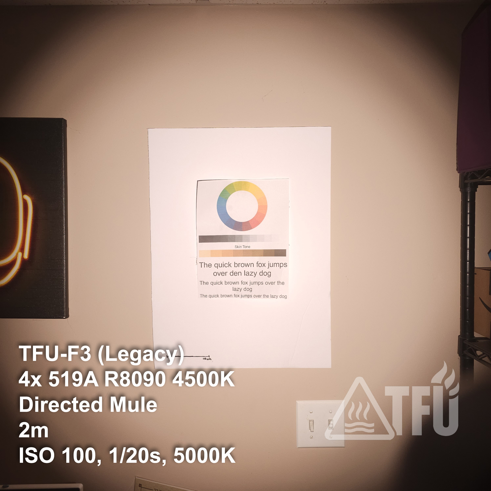
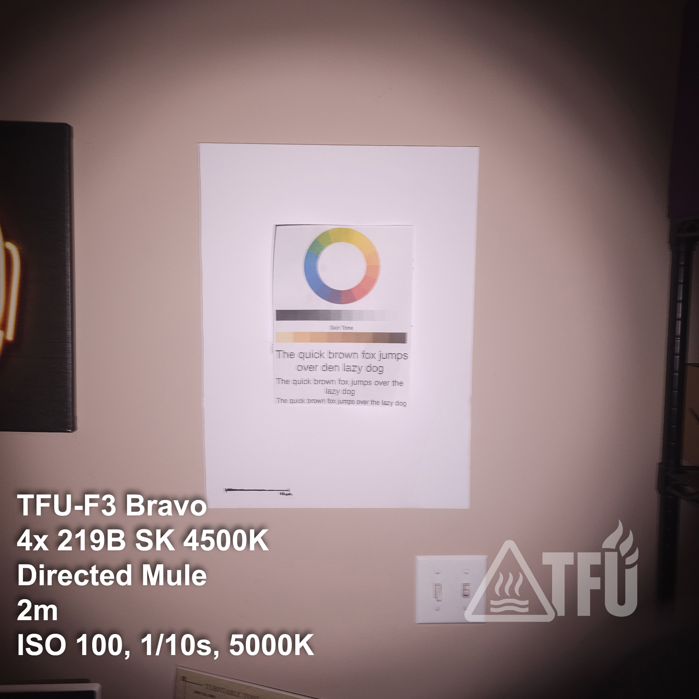
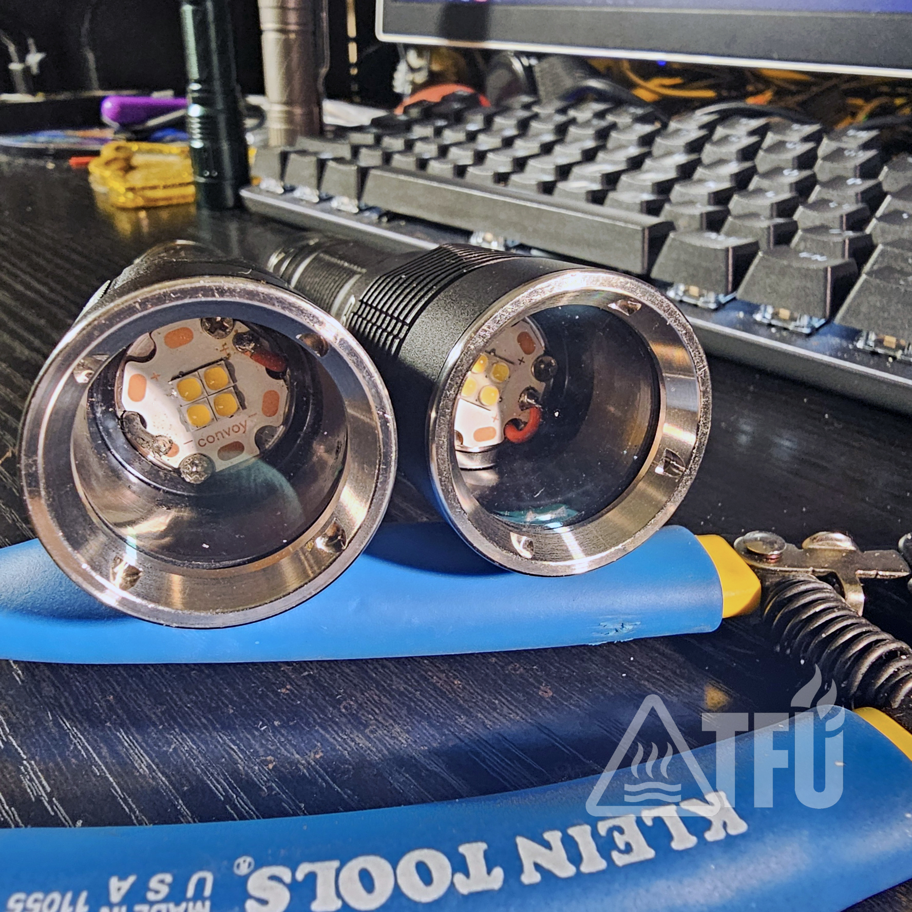
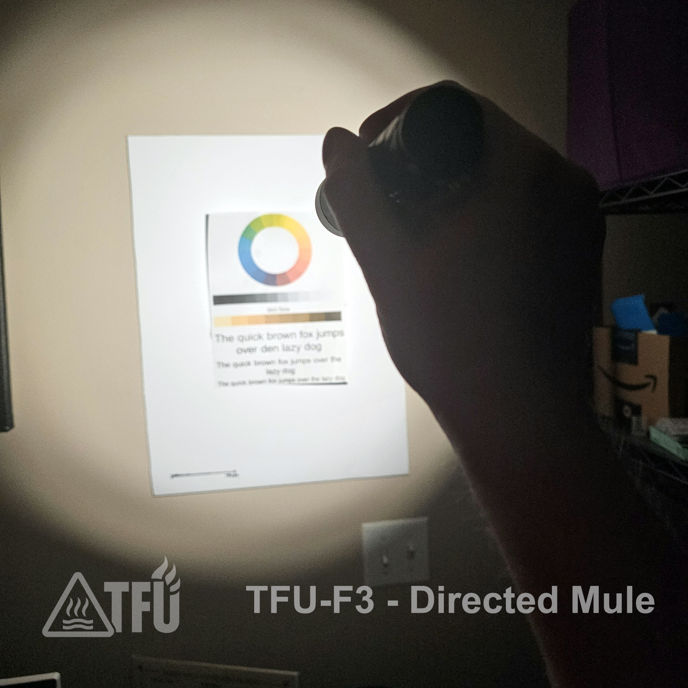

# TFU-F3

**Series:** F (Field)  
**Host:** Convoy S16  
**Colorway:** Black

The **TFU-F3** is a high-output field/work light built on the Convoy S16 platform and configured as a *directed mule* for maximum flood and situational awareness. High-CRI output, wide coverage, and rugged construction make it a dependable tool for real field environments — not a desk piece. Built and tested in the U.S.

# LEDs and CCT  

Current TFU-F3 builds use a Nichia 519A 5000K emitter with a 6 V 5 A boost driver.
Earlier F3 configurations using different emitters or drive levels are archived as legacy builds and are no longer produced.

# TFU-F3 Platform — Directed Mule Lights

The F3 platform uses a **2S2P 21700 architecture** to drive quad-emitter MCPCBs at high current without optics. This creates a controlled, high-angle flood ideal for field tasks, troubleshooting, workspace lighting, and enclosed environments where beam discipline is not required.

Heavy thermal mass + oversized drivers + tuned emitters  
→ **raw output, stable color, zero surprises.**

---

## TFU-F3 Legacy (Discontinued)

- **Emitters:** Quad Nichia 519A 4500 K (2S2P)  
- **Driver:** 6 V 8 A buck  
- **Notes:** Very high current draw, extremely high output; established the F3 thermal/beam architecture.  
- **Status:** Retired prototype.

---

## TFU-F3 

- **Emitters:** Quad Nichia 519A 5000 K (2S2P)  
- **Driver:** 6 V 5 A boost  
- **Beam:** Clean daylight-neutral white, high CRI, excellent situational flood.  
- **Status:** [**Available**](TFU-F3-Alpha.md)

---

## TFU-F3 Bravo (Discontinued)

- **Emitters:** Quad Nichia 219B SW45K 4500 K (2S2P)  
- **Driver:** 6 V 3 A buck  
- **Beam:** Cinematic tint, ultra-high CRI, warm and immersive.  
- **Status:** [**Discontinued**](TFU-F3-Bravo.md)

---

## Product Shot

  
*TFU-F3 on field kit. Quad mule configuration for maximum flood and situational awareness.*

## Kit Context

  
*Built for real field kits — not shelf duty.*

## Internals / Build Detail

  
*Quad MCPCB, hardened driver install, and Molicel P45B. No shims, no shortcuts — TFU creed.*

---

## Beam Comparisons and Emitter Profiles

| Variant | Description | Image |
|--------|-------------|-------|
| **F3 Legacy** | Quad 519A 4500 K — neutral white with balanced tone. |  |
| **F3 Bravo** | Quad 219B SW45K — warm rosy tint, ultra-high CRI. |  |
| **Head Comparison** | Legacy vs Bravo MCPCBs. |  |
| **Directed Mule Demo** | Bare-emitter controlled flood. |  |

---

## Specifications

- **Cell format:** 21700  
- **Recommended cell:** Molicel P45B  
- **Standard emitter:** Quad Nichia 519A 5000 K (90 CRI)  
- **Optional variant:** Quad Nichia 219B SW45K 4500 K (95 CRI)  
- **Driver options:**  
  - 6 V 5 A Boost (Alpha)  
  - 6 V 3 A Buck (Bravo)  
- **UI:** Mode Group 10 (1 % → 10 % → 35 % → 100 %), memory off  
- **Optic:** None (directed mule)  
- **Runtime:** High sustained output; minimal thermal throttling (see runtime charts)  
- **Weight:** 120 g (dry)  
- **Dimensions:** 126 mm × 33 mm  
- **Clip:** Black steel deep-carry  
- **Hardening:** MX-4, CS109 thermal adhesive, Loctite 242  
- **Water:** IPX8 tested  
- **Impact:** 1 m drop tested  
- **Electrical mod:** 22 AWG tail spring bypass  

---

# Low Voltage Protection (LVP) Behavior — TFU-F3

The F3 uses on-driver LVP to prevent over-discharge.

### LVP Reaction Points

- **~3.2 V under load:**  
  - Attempting 100 % causes **1 blink → automatic return to 35 %**.  
- **Below 3.2 V:**  
  - **35 % becomes unstable** as voltage falls.  
  - **10 % remains stable** down to ~3.0 V under load.
- **~3.0 V under load:**  
  - **10 % drops out** → **Stop use and swap the cell.**

### Operator Guidance

- Treat the first **blink → 35 %** as **SWAP SOON**.  
- Use **10 %** to finish the task.  
- If **10 % drops**, the cell is effectively done for the cycle.  
- After resting 10 mins, if OCV reads **~3.0 V**, stop using it until recharged.

### Quick Reference (Under Load)

| Voltage | Behavior | Action |
|--------:|----------|--------|
| ≥ 3.6 V | All modes normal | Full use |
| 3.2–3.6 V | 100 % gated; 35 % stable | Swap soon |
| 3.0–3.2 V | 35 % unstable; 10 % stable | Finish task |
| < 3.0 V | 10 % drops out | Stop use |

---

## Role & Deployment

The TFU-F3 is purpose-built for:

- Field work  
- Workspace illumination  
- Inspection and troubleshooting  
- Enclosed environments  
- Tasks requiring high CRI and maximal area lighting

Not intended for stealth or tactical operations.

### F3 Variants

- **F3 (519A 5000 K)** – Standard production; daylight-neutral.  
- **F3 Bravo (219B 4500 K)** – Warm/rosy high-CRI variant.

---

## Runtime & Thermal Performance

*Placeholder — replace with test results once baseline runs complete.*

---

## Tuning & Options

TFU-F3 lights are hand-built and tuned.  
Custom CCT, emitters, and firmware available upon request for kit integration.

---

### CCT Standardization Note — October 2025

Current TFU-F3 production is standardized to:

- **Nichia 519A 5000 K (90 CRI)** as the default  
- **219B SW45K 4500 K (95 CRI)** for the Bravo variant
