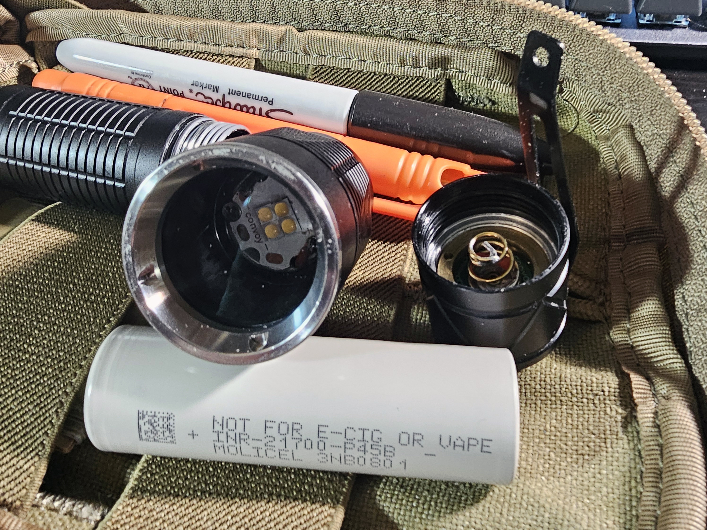

# TFU-F3

**Series:** F (Field)  
**Host:** Convoy S16  
**Colorway:** Black and grey  

The TFU-F3 is a high-output field/work light built on the robust Convoy S16 platform and configured as a mule for maximum flood and situational awareness. Designed for sustained high-CRI output in open or enclosed work areas where beam discipline is not a priority. Built and tested in the U.S., the F3 is the first Field series model to reach production — F1 and F2 remain in development.

## Product Shot  
  
*TFU-F3 shown on field kit. Quad 519A mule, built for maximum flood and situational awareness.*  

## Kit Context  
  
*TFU-F3 alongside everyday field tools. Not a desk toy—this mule rides with real gear.*  

## Internals / Build Detail  
  
*Quad 519A MCPCB, hardened driver install, and Molicel P45B cell. No shims, no shortcuts—TFU creed applied.*  

## Beamshot (Wall of Light)  
  
*Full mule flood: situational awareness over distance. A wall of light, not a hotspot.*  

## Specifications

- **Cell size:** 21700  
- **Recommended cell:** Molicel P45B  
- **Driver:** 6 V 8 A Buck  
- **Emitter:** Nichia 519A Quad (4500 K, 90 CRI)  
- **User interface:** Mode group 10 (1 % → 10 % → 35 % → 100 %), memory off  
- **Runtime:** Sustained high output without aggressive thermal throttling (see runtime charts)  
- **Optic:** Carclo quad mule (no optic) for maximum flood  
- **Weight:** 120 g (dry)  
- **Dimensions:** 126 mm length × 33 mm head diameter  
- **Clip:** Black steel deep-carry  
- **Hardening:** Loctite 242, CS109 thermal adhesive, MX-4 thermal paste  
- **Water protection:** IPX8 tested  
- **Impact resistance:** 1 m drop tested  
- **Electrical mod:** Tail spring bypass (22 AWG)  

## Low Voltage Protection (LVP) Behavior – TFU-F3

The TFU-F3 driver includes built-in **Low Voltage Protection (LVP)**.  
This prevents cell over-discharge and ensures continued safe operation in the field.

- **Trigger point:** ~3.2V cell voltage  
- **Behavior:**  
  - When attempting to engage **Level 4 (100%)**, the light will blink once, then automatically step back to **Level 3 (35%)**.  
  - This is not a fault condition. It is the driver signaling that the cell voltage is below the threshold for sustained maximum output.  
- **Result:** The light remains operational at reduced levels rather than cutting off completely, extending usable runtime while protecting the cell.  

### Field Notes
- If you encounter blink + fallback, **swap or recharge the cell**.  
- Behavior is most often observed during extended patrols or after leaving a cell in the light down to storage voltage.  
- Do not bypass LVP. It is integral to safe operation and preserves both the driver and 18650 cells.

## Role & Deployment

The TFU-F3 is intended for **field tasks, workspace lighting, and inspection** where maximum area coverage and color accuracy are more important than throw or beam discipline. The 4500 K quad mule configuration renders colors accurately and reduces eye strain, making it ideal for prolonged use in dynamic environments. Not intended for low-signature or tactical operations.

### LVP Characterization – Quick Test

**Goal:** Determine behavior between 3.2 V and driver cutoff.

**Setup**
- Cell: P45B at ~3.25 V open-circuit (rested).
- Meter across cell; log voltage every 30–60s.
- Ambient noted; fan off (realistic thermal).
- Modes tested in order: 35% → 10% → 1%.

**Procedure**
1. Insert cell (~3.2 V under load). Select **35%**; note any blinks/step.
2. Log time-to-**~3.0 V under load** and any auto step-down/cutoff.
3. Switch to **10%**, repeat logging until cutoff or ~2.9 V under load.
4. Switch to **1%**, repeat, then remove cell. Record **recovered OCV** after 10 min.

**Record**
| Mode | Start V (load) | Time to 3.0 V | Behavior (blink/step/cut) | End V (load) | Recovered OCV (10 min) |
|------|-----------------|----------------|---------------------------|--------------|------------------------|
| 35%  |                 |                |                           |              |                        |
| 10%  |                 |                |                           |              |                        |
| 1%   |                 |                |                           |              |                        |

**Pass/Fail (Operator)**
- Pass: Holds 35% without oscillation; 10%/1% remain stable; clean cutoff (no flicker).
- Fail: Flicker, brown-outs, or recovery OCV < ~3.0 V (don’t run that low in field use).

## Runtime & Thermal Performance

  
*Placeholder — replace with runtime and thermal curve once baseline test is completed.*

**Test parameters:**  
- Cell: Molicel P45B, fully charged at 4.20 V  
- Mode: 100 % (Mode Group 10)  
- Ambient: *TBD* °C  
- Distance to lux sensor: *TBD* m  
- Logging interval: *TBD* seconds  

## Tuning and Options

Each TFU-F3 is hand-built and tuned for reliable sustained output. Optics, emitter CCT, and firmware options can be customized to suit your operational needs. Contact TFU for special orders or kit integration.
