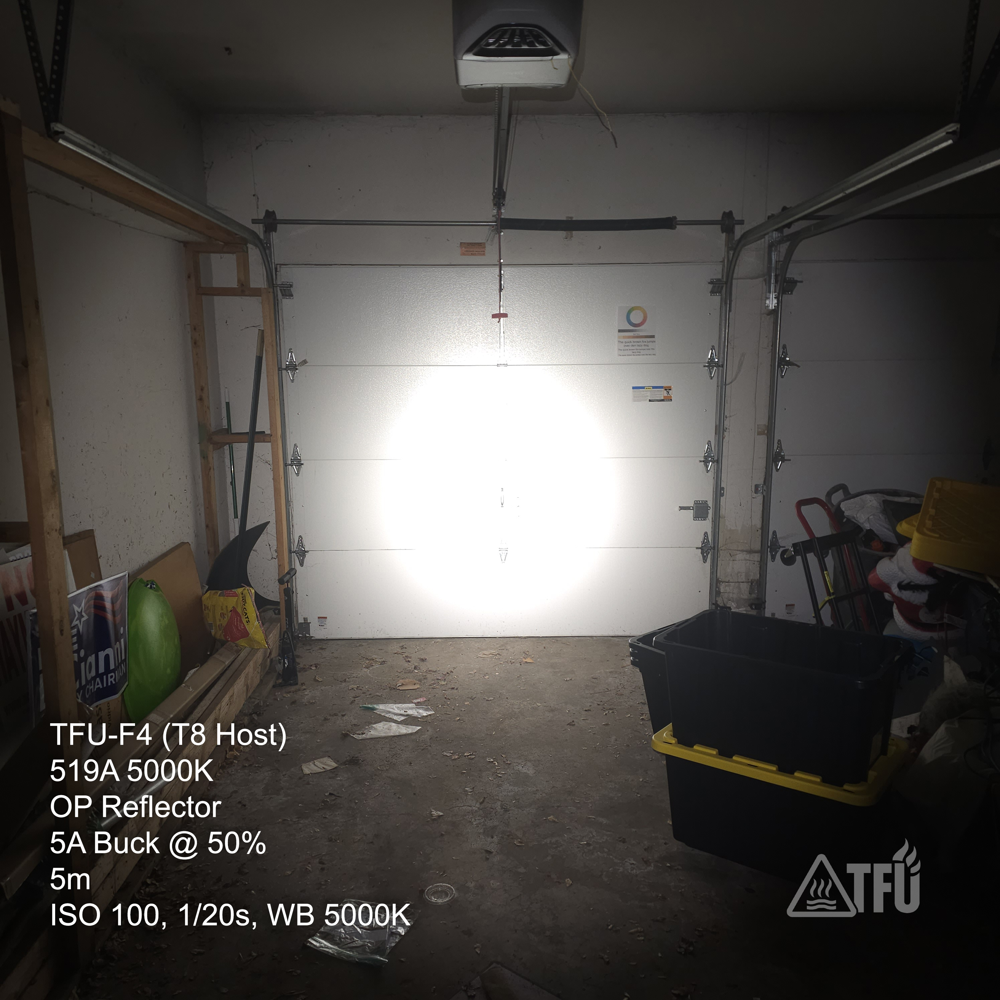
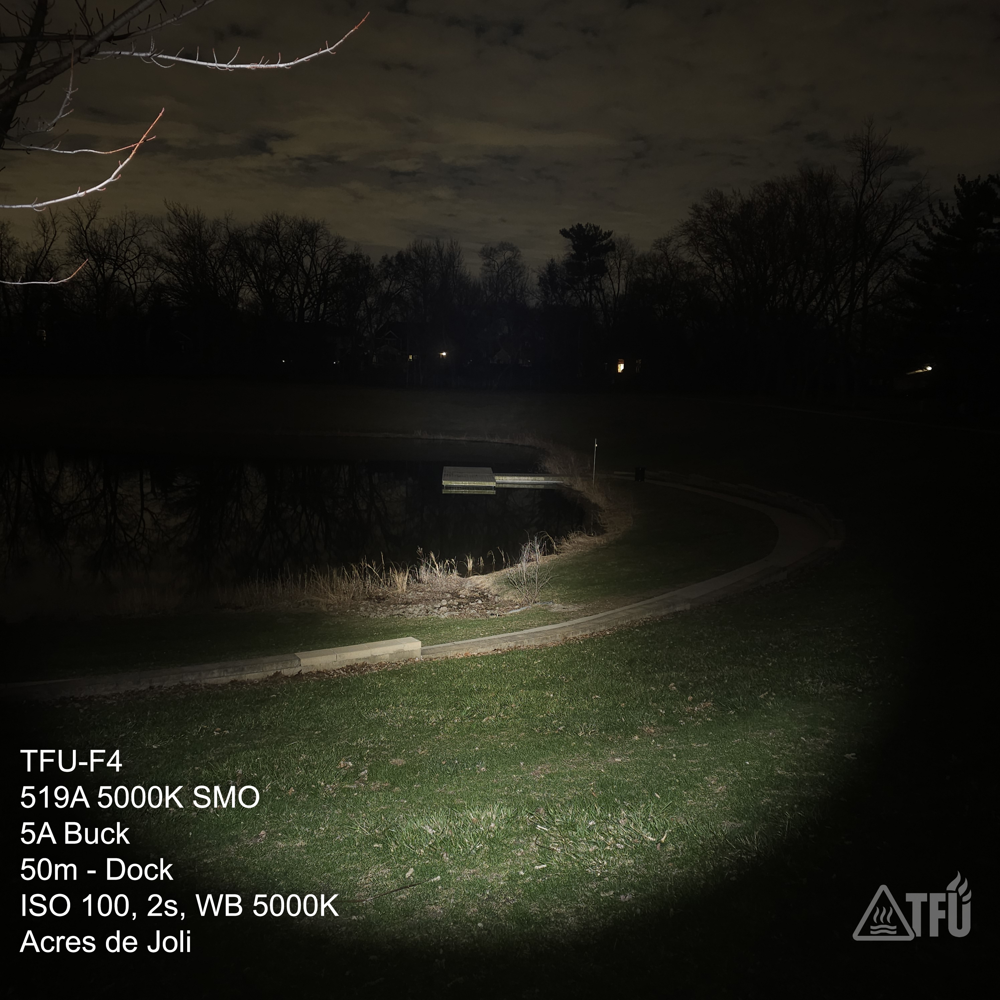

# TFU-F4 – Ultralight Field Light

**Series:** TFU-F (Field)  
**Model:** TFU-F4  
**Status:** Production Ready  
**Mission Profile:**  
Ultralight field light designed for high-CRI spotting and identification at distance. Optimized for minimal weight, controlled throw, and regulated output in a compact 14500 platform.

---

## Build Evolution

The TFU-F4 was developed to fill a gap in the TFU lineup:

> A lightweight field tool capable of delivering a clean, high-CRI spot without the size and weight of 18650/21700 platforms.

Early concepts explored adapting existing E-series configurations, but these lacked the beam control and reach required for field spotting tasks.

The platform settled on the **Convoy T8 host**, which provides:

- Compact form factor  
- Adequate thermal mass for short-duration high output  
- A reflector profile capable of controlled throw in a 14500 system  

The final configuration defines the F4 as a **specialized field instrument**, not a general-purpose light.

---

## Build Specifications

| Component | Detail |
|------------|---------|
| **Host** | Convoy T8 – compact 14500 platform with reflector |
| **Emitter** | Nichia 519A (5000 K) – high CRI, neutral tint |
| **Driver** | 5 A Buck Driver – regulated, efficient output |
| **Switch** | Forward clicky – responsive, field-friendly |
| **Clip** | Deep-carry steel clip |
| **Bypass** | Tail spring bypass (low resistance) |
| **Thermal** | MX-4 under MCPCB |
| **Securing** | Loctite on retaining rings |

---

## Power Source

| Cell | Notes |
|-------|--------|
| **Vapcell K10** | High-output 14500 – preferred for standard configuration |
| **Vapcell F12** | Balanced runtime option |
| **Vapcell F15** | Maximum runtime within platform limits |

---

## Output & User Interface

| Parameter | Value |
|------------|--------|
| **Primary Mode Group** | 1 % → 20 % → 100 % |
| **Optional Mode Group** | 1 % → 10 % → 50 % |
| **Memory** | Configurable |
| **UI Type** | Stepped modes |
| **Beam Profile** | Defined hotspot with usable spill – throw-biased |

---

## Performance Characteristics

- **Effective Range:** ~75 m  
- **20 % Mode:** Primary working level – strong usable throw  
- **50 % Mode:** Sustained output (endurance configuration)  
- **100 % Mode:** Maximum reach, short-duration bursts  
- **Regulation:** Flat output curve via buck driver  

The F4 is designed for **intentional use**, not continuous high-output operation.

---
## Beamshots  
  
>5m test shot at the indoor range.

>50m dock, high CRI spot.  Champ de tir des Acres du Joli.  

---

## Use Case

- Field spotting and identification  
- Inspection at distance  
- Lightweight kit integration  
- Supplemental light alongside flood/area lighting  

Not intended as a primary flood or extended runtime platform.

---

## Testing Notes

- Beamshot validation at 5 m / 25 m / 75 m  
- Thermal observation at 100 % (short-duration behavior)  
- Mode usability validation (20 % vs 50 % field comparison)  
- Runtime comparison across K10 / F12 / F15 cells  
- Carry and deployment testing in compact field kits  

---

> **TFU – Real Gear for Hard Use**  
> Purpose-built tools. No excess.

---

**Version:** v1.0  
**Last Updated:** 2026-04-13  
**[← Back to README](../README.md)**
