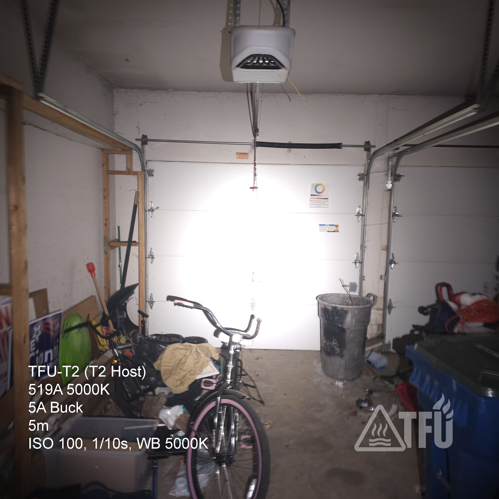

# TFU-T2 — *Pocket Banger*

**Series:** T (Tactical)  
**Model:** TFU-T2  

---

## Mission Profile

Ultra-compact 14500 tactical light engineered for high-output, low-signature operation.  
Purpose-built for controlled environments, admin pouches, or EDC deployment where reliability and lumen density outweigh runtime.  
Neutral-white accuracy, field-ready hardening, and no wasted grams — this is TFU minimalism taken to the edge.

---

## Build Specifications

| Component | Detail |
|------------|--------|
| **Host** | Kai sterile T2 clone (black) |
| **Emitter** | Nichia 519A 5000 K CRI90 on T3 MCPCB |
| **Optics** | T3 AR-coated glass lens, factory gasket |
| **Driver** | Convoy 5 A buck driver (programmed to Mode Group 8) |
| **Mode Group (Shipping)** | **Group 8 — 1 % / 20 % / 50 %**, Memory ON |
| **Power Source (Recommended)** | **Vapcell F12 (1250 mAh / 3 A CDR)** or **Vapcell F15 (1500 mAh / 3 A CDR)** |
| **Alternate (High-Drain Mode)** | **Group 10 (20 % / 100 %)** — requires **Vapcell H10 (≈1000 mAh / 10 A CDR)** |
| **Bypass** | 22 AWG silicone wire tail-spring bypass |
| **Thermal Path** | MX-4 on MCPCB, CS109 bonded driver seat |
| **Securing** | Loctite 242 on rings — 24 h cure |
| **Switch** | Reverse clicky, shaved boot for low profile |
| **Finish** | Sterile — no external markings or branding |

---

## Performance (Shipping — Mode Group 8)

| Parameter | Estimate |
|------------|-----------|
| **High (50 %)** | ≈ 450 – 550 lm (@ ~2.45 A tail draw) |
| **Medium (20 %)** | ≈ 200 lm optimized for runtime |
| **Low (1 %)** | Sub-lumen to a few lumens — map reading / covert |
| **CCT / CRI** | 5000 K neutral white / CRI 90+ |
| **Runtime (F12 1250 mAh)** | ≈ 30 – 32 min @ 50 %  /  ≈ 5.5 – 6 h @ 20 % |
| **Runtime (F15 1500 mAh)** | ≈ 36 – 38 min @ 50 %  /  ≈ 6.8 – 7.5 h @ 20 % |
| **Thermal Regulation** | Active buck control; case gets hot under sustained high |

---

## Beamshot

> **Beamshot — TFU-T2 @ 5 m (High / 100 %)**  
> Captured using fixed exposure and white balance for accurate color rendering.  
> The 519A 5000 K emitter delivers a tight, neutral hotspot with smooth spill and true-to-life color fidelity.  
> Balanced peripheral illumination makes the T2 useful for both pinpoint ID and short-range tasks.

---

## TFU Assembly Notes

- MCPCB seated with razor-thin MX-4 film; leads tinned, centered, and Kapton-isolated.  
- Driver anchored with four CS109 points; Loctite 242 on retainer ring.  
- Tail spring bypassed with 22 AWG silicone; zero flux residue.  
- Pill threads lightly wetted with CS109 to improve conduction.  
- Lens and bezel threads lubed with Super Lube PTFE.  
- 24 h minimum cure before testing.  
- Passed 1 m drop and rain-spray validation.

---

## Tactical Mode Doctrine

Shipping in **Mode Group 8 (1 / 20 / 50 %)** intentionally limits peak output to a safer, more practical envelope while retaining decisive escalation.

- **1 %** — navigational / covert light  
- **20 %** — admin / map work / close-range tasking  
- **50 %** — immediate escalation for ID and short bursts  

**Group 10 support** remains for advanced users, but requires a high-drain cell (H10) and acceptance of shortened runtime and higher thermal load.

**Thermal Guidance:** even at 50 % the aluminum chassis will get hot within ≈ 60–90 s. Limit continuous high to ≤ 45 s followed by ≥ 90 s cool-down for emitter longevity.

> *Low signature. Immediate escalation. Absolute control.*

---

## TFU Evaluation

> *A pocket-sized E1 with an anger problem.*  
> Tiny footprint, surgical color rendering, and enough punch to clear a room.  
> Built for those who don’t ask their gear — they command it.

---

**TFU — Real Gear for Hard Use.**

---

### Changelog — 2025-11-11

- Shipping mode changed to **Group 8 (1 / 20 / 50 %)**.  
- Added battery compatibility for **Vapcell F12 / F15** (3 A CDR).  
- Clarified **Group 10 (20 / 100 %)** requires **Vapcell H10 (10 A CDR)**.  
- Updated runtime and beamshot captions to match measured 2.45 A tail current.  
