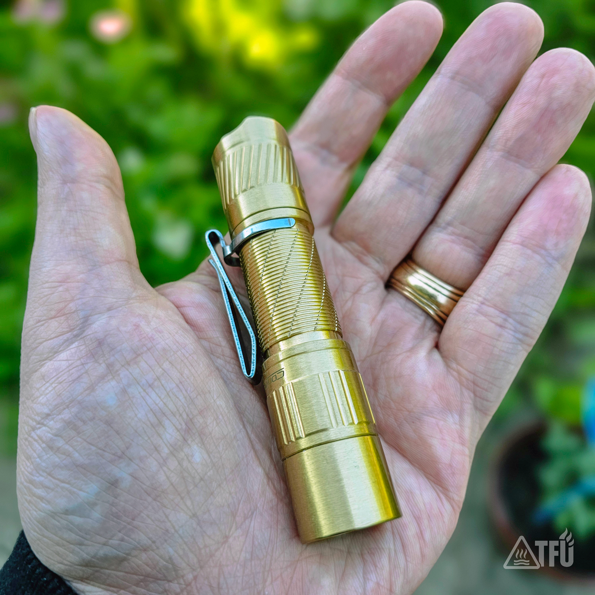

# TFU-T2B Hardware Specification

## Model **TFU-T2B**  

## Platform **E Series**  

The TFU-T2B is built on the **Brass T3** platform and configured as a premium 14500 everyday-carry light with a warm high-CRI emitter, upgraded optics, improved contact treatment, and TFU final inspection.

---

## Core Hardware

| Component | Specification |
|---|---|
| Host | Convoy Brass T3 |
| Emitter | Nichia 519A |
| CCT | 4000K |
| Driver | Factory 1.5A driver |
| Battery | Vapcell F15 14500 |
| Lens | AR-coated glass |
| Bezel O-ring | Black O-ring |
| Clip | Silver Convoy T6 clip |
| Mode Group | Group 5 |
| Modes | 1% / 20% / 100% |

---

## Required Parts

- Convoy Brass T3 host
- Nichia 519A 4000K emitter
- Vapcell F15 14500 cell
- Silver Convoy T6 clip
- AR-coated glass lens
- Black bezel O-ring

---

## TFU Build Work

Each TFU-T2B receives the following work:

- Replace factory GITD bezel O-ring with black O-ring
- Replace factory lens with AR-coated glass lens
- Install silver T6 clip
- Lubricate all threads and O-rings with Super Lube
- Apply CAIG DeoxIT to driver contact surfaces and spring
- Configure driver to Mode Group 5 (1% / 20% / 100%)
- Test with a Vapcell F15 14500 cell

---

## Final Mode Configuration
| Mode   | Output | Lumens (est.) | Runtime (est.) |
| ------ | -----: | ------------: | -------------: |
| Low    |     1% |      **2 lm** |  **≈ 13 days** |
| Medium |    20% |     **50 lm** |   **≈ 19 hrs** |
| High   |   100% |    **240 lm** |    **≈ 4 hrs** |

---

## Engineering Notes

The TFU-T2B uses the factory **1.5A regulated driver**.

A switch bypass was evaluated and rejected for production. At this current level, the small reduction in resistance does not justify modifying the switch assembly.

Loctite 242 on the switch retaining ring was also evaluated and determined unnecessary for the final configuration.

CAIG DeoxIT treatment was retained because testing showed improved contact behavior and more consistent operation.

The production philosophy is simple:

> **Only modifications that produce measurable improvements are retained.**

---

## Final Production Configuration

| Item | Status |
|---|---|
| Black bezel O-ring | Required |
| AR-coated glass lens | Required |
| Silver T6 clip | Required |
| Super Lube thread and O-ring service | Required |
| CAIG DeoxIT contact treatment | Required |
| Switch bypass | Not used |
| Loctite 242 on switch retaining ring | Not used |
| Vapcell F15 functional test | Required |

---

## Included Battery

The TFU-T2B is tested and sold with a **Vapcell F15 14500 lithium-ion cell**.

---

## Pricing

| Item | Price |
|---|---:|
| TFU-T2B | $69 |
| Vapcell F15 14500 | $0 |
| **Ready-to-run package** | **$69 + shipping** |

---

## Build Status

**Production configuration finalized.**

Current hardware specification reflects the standard TFU-T2B build.  

---

## Serial Format

`TFU-T2B-XXX` First T2B is TFU-T2B-001, etc.  

---

Rev 1.1
